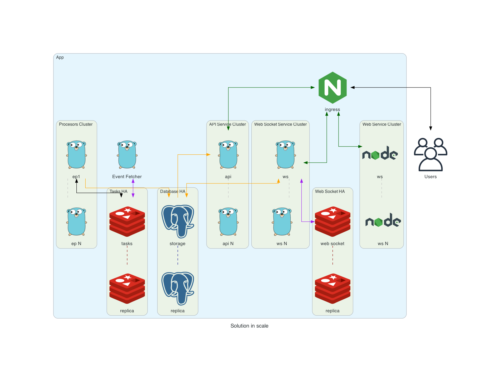

# Solution Architecture & Design

## Overview

This solution provides a robust system to fetch, process, and serve plans from an external provider. It's designed for high availability, performance, and scalability with a microservice architecture.

## How to Run This Solution

### Prerequisites

- Docker and Docker Compose
- Go 1.24+
- Redis
- PostgreSQL

### Setup and Run

1. Clone this repository
2. Install dependencies: `make deps`
3. Build the application: `make build`
4. Run the solution: `make run`

## Architecture

This solution is designed to scale horizontally as demand increases:

### Main Components

1. **API Layer**
Stateless REST API services that handle client requests for plans. These can be scaled horizontally behind a load balancer.

2. **Event Fetcher**
Responsible for periodically retrieving data from the external provider's API.

3. **Event Processor**
Processes fetched events and stores them in the database.

4. **Data Storage**

- PostgreSQL for persistent storage of plans
- Redis for caching and job queuing

### Component Workflows

1. API Flow

2. Event Fetcher Flow

3. Event Processor Flow

## Deployment

The solution includes a `docker-compose.dev.yml` file for local development. For production, a container orchestration system (Kubernetes, ECS, etc.) is recommended to:

- Enable auto-scaling of services
- Implement health checks and automatic restarts
- Provide load balancing
- Support rolling updates
- Configure Redis service with persistence to prevent data loss during restarts.

## Monitoring and Observability

The solution incorporates:

- Prometheus for metrics collection
- Distributed tracing
- Structured logging with Zap

### Future Enhancements

- Health check endpoints
- Implement a cache warming strategy
- Add data validation and schema versioning
- Implement advanced retry strategies with exponential backoff
- Add comprehensive monitoring dashboards
- Integrate with service mesh for advanced traffic management

## What could be improved in this solution?

### System Resilience

- Circuit Breaker Pattern: Prevents cascading failures when external services are down
- Rate Limiting: Protects both our services and external APIs
- Retry Mechanisms: With exponential backoff for transient failures
- Data Redundancy: Through database replication

### Performance Optimizations

API Layer

- Caching: Redis or Elastic Search improves response times
- Circuit Breaker: Fallback to DB when caching service is unavailable
- Connection Pooling: For database connections

Event Fetcher

- Adaptive Scheduling: Dynamic intervals based on provider API behavior
- Monitoring: Comprehensive metrics and alerting with clear SLAs
- Batching: Processing events in batches for efficiency

Event Processor

- Worker Scaling: Adjust worker count based on queue size
- Prioritization: Process high-value events first
